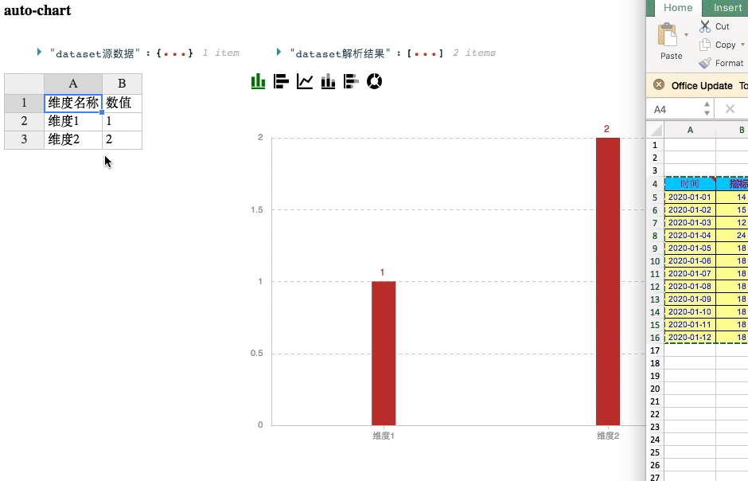

# auto-chart
图表工具集(util)，内置推荐图表(advisor)、数据转换(transform)、echarts模版

## Document
[http://auto-chart.jd.com](http://auto-chart.jd.com)

## Install
``` bash
# install jnpm
npm install @jd/jnpm -g --registry=http://registry.m.jd.com
# install pkg
jnpm install @jd/auto-chart

# or use npm only
npm install @jd/auto-chart --registry=http://registry.m.jd.com

```

## Usage

准备： [dataset教程](https://echarts.apache.org/zh/tutorial.html#%E4%BD%BF%E7%94%A8%20dataset%20%E7%AE%A1%E7%90%86%E6%95%B0%E6%8D%AE)


### React中使用
```tsx
import { transform } from '@jd/auto-chart';
import { AutoChart } from '@jd/auto-chart/lib/react';

const data = [
    {
        name: "列名称1",
        value: 11,
        precent: 0.22,
    },
    {
        name: "列名称2",
        value: 55,
        precent: 0.33,
    },
    {
        name: "列名称4",
        value: 45,
        precent: 0.25,
    },
    {
        name: "列名称5",
        value: 35,
        precent: 0.14,
    },
];
// 给维度名称重命名
const alias = {
    name: "name",
    value: "指标1",
    precent: "百分比",
};
// 转换为dataset
const dataset = transform.arrayToDataset(source, alias);

return (
    <AutoChart
        echartOptions={{
            dataset,
        }}
        dataTransform={(field, value) => {
            if (field === "百分比" ) {
                return `${value * 100}%`;
            }
            return value;
        }}
    ></AutoChart>
);
```

### 非React中使用

```ts
import echarts from 'echarts';
import { autoChart, transform } from '@jd/auto-chart';

const data = [
    {
        date: "2020-11-01",
        value: 11,
        precent: 0.22,
    },
    {
        date: "2020-11-02",
        value: 55,
        precent: 0.33,
    },
    {
        date: "2020-11-03",
        value: 45,
        precent: 0.25,
    },
    {
        date: "2020-11-04",
        value: 35,
        precent: 0.14,
    },
];
// 给维度名称重命名
const alias = {
    date: "日期",
    value: "指标1",
    precent: "百分比",
};
// 转换为dataset
const dataset = transform.arrayToDataset(source, alias);

// 得到一个echart可用的options
const chartOptions = autoChart(dataset, {
    dataTransform: function(field, value) {
        if (field === "百分比" ) {
            return `${value * 100}%`;
        }
        return value;
    }
});
const myChart = echarts.init(container, 'light');
myChart.setOption(chartOptions)
```


### 指定图表类型
```ts
import echarts from 'echarts';
import { getChartOption, CHART_TYPES, util } from '@jd/auto-chart';

const dataset = {
    dimensions: ["option", "percent"],
    source: [
        {
            option: "京东超级品牌日",
            percent: 87
        },
        {
            option: "京东超级神券日",
            percent: 82
        },
        {
            option: "京东超级秒杀日",
            percent: 79
        },
        {
            option: "京东plus day",
            percent: 68
        }
    ]
};


const chartOptions = getChartOption(CHART_TYPES.line, {
    echartOptions: {
        dataset: dataset,
    },
    dataTransform (dimension: string, value: any) {
        // 处理小数
        if (typeof value == "number") {
            return `${util.keepDecimalFixed(value, 1)}%`;
        }
        return value;
    }},
    // 设置容器宽度能够自动调整图表样式
    // width: container.current?.clientWidth || autoChartConfig.width
});

const myChart = echarts.init(container, 'light');
myChart.setOption(chartOptions)
```

### 通过advisor + getChartOption 可实现如下功能(参考stories/react-component/ChartSwitch.tsx)


